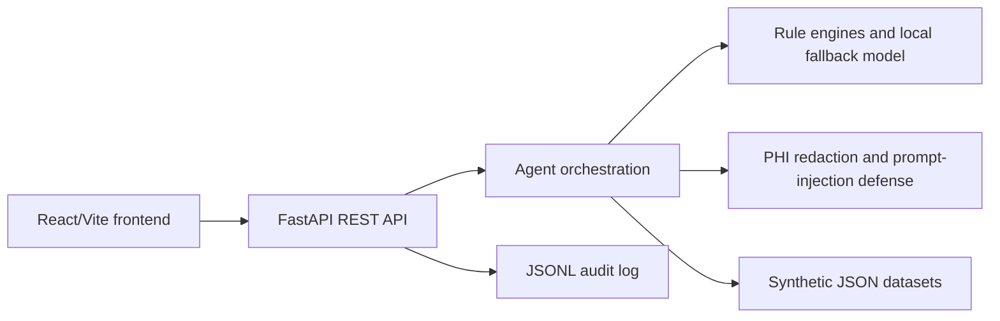

# CareBridge AI Agent

CareBridge AI Agent is a ready-to-run, synthetic-data healthcare decision-support application for authorized clinical and operations users. It helps reason over patient summaries, care gaps, readmission risk, clinical notes, and healthcare analytics workflows while keeping a strict human-in-the-loop safety posture.

> **Clinical decision support only. Not a substitute for professional medical judgment.** The app does not provide diagnosis, treatment orders, or emergency medical advice. All clinical recommendations require clinician review.

## Agent role

CareBridge supports clinicians, care managers, informaticians, and quality improvement teams by returning structured JSON, evidence snippets, confidence levels, and suggested next actions for:

- Patient Summary Agent
- Care Gap Agent
- Readmission Risk Assistant
- Clinical Note Intelligence
- Healthcare Operations Copilot

## Architecture



## Repository layout

```text
backend/app/main.py                  FastAPI app and endpoints
backend/app/agents/                  Agent workflows and readmission rules
backend/app/security/                PHI redaction, RBAC, prompt guardrails
backend/app/services/                Synthetic data loader and audit log service
backend/app/data/synthetic/          Synthetic patients, encounters, labs, meds, notes, SDOH
frontend/src/App.jsx                 Responsive clinical workspace UI
backend/tests/                       Unit and integration tests
```

## Local setup

```bash
cp .env.example .env
python -m venv .venv
source .venv/bin/activate
pip install -r requirements.txt
uvicorn backend.app.main:app --reload
```

In another terminal:

```bash
cd frontend
npm install
npm run dev
```

Open the frontend URL printed by Vite. The API defaults to `http://localhost:8000`.


## Troubleshooting: patient selector is empty

If the frontend loads but the synthetic patient dropdown is empty, the frontend usually cannot reach the backend API.

1. Confirm you are in the repository root.

   ```bash
   pwd
   ```

   You should be in the folder that contains `README.md`, `backend/`, and `frontend/`.

2. Start the backend from the repository root.

   On macOS/Linux/Git Bash:

   ```bash
   source .venv/bin/activate
   python -m uvicorn backend.app.main:app --reload --host 0.0.0.0 --port 8000
   ```

   On Windows Git CMD:

   ```cmd
   .venv\Scripts\activate
   py -m uvicorn backend.app.main:app --reload --host 0.0.0.0 --port 8000
   ```

3. Open these URLs directly in your browser:

   ```text
   http://localhost:8000/health
   http://localhost:8000/patients
   ```

   `/health` should return `"status":"ok"`, and `/patients` should return a JSON list with `SYN-1001`, `SYN-1002`, and `SYN-1003`.

4. Start the frontend in a second terminal.

   ```bash
   cd frontend
   npm install
   npm run dev
   ```

5. Open the frontend, usually `http://localhost:5173`, and click **Reload patients** if needed.

6. If the frontend still cannot connect, create `frontend/.env.local` with:

   ```text
   VITE_API_BASE_URL=http://localhost:8000
   ```

   Then stop and restart `npm run dev`.

## Environment variables

| Variable | Purpose |
| --- | --- |
| `MODEL_PROVIDER` | Defaults to `local-rule-based`; future model adapters can switch provider behavior. |
| `OPENAI_API_KEY` | Optional. Not required for local fallback behavior and must never be committed. |
| `AUDIT_LOG_PATH` | JSONL audit log output path. |
| `SYNTHETIC_DATA_DIR` | Directory containing synthetic JSON fixtures. |
| `VITE_API_BASE_URL` | Frontend API base URL. |

## Run tests

```bash
pytest backend/tests
```

## Example API calls

```bash
curl http://localhost:8000/health
curl http://localhost:8000/patients
curl -X POST http://localhost:8000/agent/patient-summary \
  -H 'Content-Type: application/json' \
  -d '{"patient_id":"SYN-1001","note":"Follow-up with cardiology recommended."}'
curl -X POST http://localhost:8000/agent/readmission-risk \
  -H 'Content-Type: application/json' \
  -d '{"patient_id":"SYN-1001"}'
curl -X POST http://localhost:8000/redact-phi \
  -H 'Content-Type: application/json' \
  -d '{"text":"Name: Jane Doe phone 555-123-4567 MRN: AB1234"}'
```

## API endpoints

- `GET /health`
- `GET /patients`
- `GET /patients/{patient_id}`
- `POST /agent/patient-summary`
- `POST /agent/care-gaps`
- `POST /agent/readmission-risk`
- `POST /agent/note-extraction`
- `POST /agent/ask`
- `GET /audit-logs`
- `POST /redact-phi`

Each agent response follows the common structure with `agent_name`, `patient_id`, `summary`, `findings`, `recommendations`, `risk_score`, `risk_tier`, `evidence`, `confidence`, `requires_human_review`, `safety_notice`, and `generated_at`.

## Safety and compliance notes

This repository is **HIPAA-aware but not HIPAA compliant by default**. The included data is synthetic and no real PHI should be entered into the demo. A production HIPAA deployment would require, at minimum:

- Business Associate Agreements with vendors that create, receive, maintain, or transmit PHI.
- Strong identity, role-based access control, least privilege, and session management.
- Encryption in transit and at rest, managed secrets, key rotation, backups, and disaster recovery.
- Comprehensive audit logging, retention policies, monitoring, and incident response.
- Data minimization, PHI lifecycle controls, consent/authorization workflows where applicable, and DLP/redaction validation.
- Infrastructure hardening, vulnerability management, secure SDLC, and risk assessments.
- Clinical governance, validation against local policy, model monitoring, and documented human review.

## Guardrail limitations

- PHI redaction is conservative regex-based placeholder logic and can miss identifiers or over-redact benign text.
- Prompt-injection defense removes known instruction-like patterns but must be paired with model-side system prompts and secure tool design in production.
- Readmission scoring is a transparent baseline rule engine, not a validated predictive model.
- SQL suggestions are illustrative and must be adapted to your warehouse schema and dialect.
